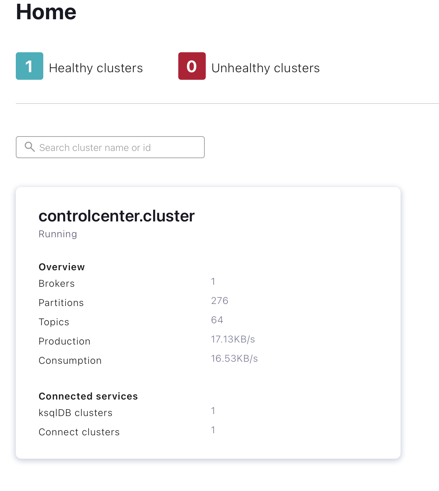

# Kafka-Streams
Demo project for how to set up Kafka Streams on Confluence

## Usecases

We are going to create a stream which shows the products that are the most rated, ratings per channel and also how frequent males open pages.

## Setting up confluent platform using docker.

1. If you are following this wiki, then you can just compose your containers from the yml file provided otherwise you can either use curl to download it from here or confluence: https://raw.githubusercontent.com/confluentinc/cp-all-in-one/6.1.1-post/cp-all-in-one/docker-compose.yml

2. Making sure that you are in the same directory as the downloaded file, you can compose up your containers:
`docker-compose up -d`


The above step will take a bit of some time depending on your internet speed.

3. If you want to see the list of containers available after this process, you can run:
`docker-compose ps`


4. Once the all the containers spool as shown above, you can no access the console (Confluent Control Center) :
http://localhost:9021. 

## Confluent Control Panel

At this point the major setup is complete, we can now experiment with topic and stream creation. Confluent provides several quick starts in avro format, these can be used whenever we want to create fake data. You can take a look at them [here](https://github.com/confluentinc/kafka-connect-datagen/tree/master/src/main/resources). This should not worry you now, we will look into it in depth later.

### Topic Creation.

1. Use a web browser of choice to navigate into the control center.
2. There should be a header with healthy clusters and unhealth clusters. If all is well you should see 1 healthy cluster. Click on controlcenter.cluster


3. There should be a listing of the available brokers, topics and connections

4. Navigate to topics and click Add a topic.

Instead of pageviews as the topic name, we are going to stream ratings, so you can use ratings.

5. Leave the rest as defaults and click create with defaults.

6. Repeat the above and create a topic for users.

### Kafka Connectors and Sample Data Generation

Since we don't have access to real data, Confluence allows us to generate stub data that we can use to test our streams. In this section we will create the generators.

1. Go back to step 3. of the previous section, instead of topics click connect. Under the connection section.
2. Click the `connect-default` in the Connect clusters list.
3. Click Add conncector.
4. Select the Datagen Connector.
5. The goal of this is to create sample data for our ratings topic. 
    a. In the `Name` field, enter `datagen-ratings`
    b. `key converter class` : `org.apache.kafka.connect.storage.StringConverter`
    c. `kafka.topic` : `ratings`
    d. `max.interval` : `100`
    e. `quickstart` : `ratings`

6. Continue and review the connector.
7. Repeat steps 1 to 6 again bur replacing `ratings` with `users`
8. Your generator file for users should be like so.


## Query Time

At this stage you are ready to create some streams and tables with ksql.

*Just a tip: You use the command line to run your ksql queries. This is done by connecting into your container like so `docker-compose exec ksqldb-cli ksql http://ksqldb-server:8088`

### Stream and Table Creation
We are going to use ksqlDB to create a stream for the ratings topic and a table for the users topic.

1. If you decided to use console, then in the navigation bar, look for and click ksqlDB. This should open a panel like:

2. Execute the following query
    ```
    CREATE STREAM RATINGS
    (RATING_ID BIGINT, USER_ID INT, STARS INT, ROUTE_ID INT,RATING_TIME BIGINT, CHANNEL VARCHAR, MESSAGE varchar)
    WITH (KAFKA_TOPIC='ratings', VALUE_FORMAT='AVRO');
    ```
    **n.b stream names are not case-sensitive**  
    The query above creates a stream of ratings, we can use ksql to query this data. This stream is then what we will use to check how many ratings are coming from each channel.
 3. We do the same for the users, however for the users we create a table rather than a stream.

    ```
    CREATE TABLE USERS
    (USERID VARCHAR PRIMARY KEY, REGISTERTIME BIGINT, GENDER VARCHAR, REGIONID VARCHAR)
    WITH (KAFKA_TOPIC='users', VALUE_FORMAT='AVRO');
    
    ```
4. Optionally we can create a stream for pageviews too.

    ```
    CREATE STREAM PAGEVIEWS
    (VIEWTIME BIGINT, USERID VARCHAR, PAGEID varchar)
    WITH (KAFKA_TOPIC='pageviews', VALUE_FORMAT='AVRO');
    ```

   We are going to use this stream joined with the users table to assess the page view distribution by gender.

## KSQL Queries

We can query streams and tables in the same way.

Below we are going to query the ratings stream.

```
select * from ratings emit changes;

```


### Retrieve rating count by channel

We are going to count for every 30 seconds how much ratings each channel has, the result will be published in the RATINGS_PER_CHANNEL topic.

``` 

CREATE TABLE RATINGS_PER_CHANNEL WITH (KAFKA_TOPIC='RATINGS_PER_CHANNEL', PARTITIONS=1, REPLICAS=1) AS SELECT
  RATINGS.CHANNEL CHANNEL,
  COUNT(*) NUMRATINGS
FROM RATINGS RATINGS
WINDOW TUMBLING ( SIZE 30 SECONDS ) 
GROUP BY RATINGS.CHANNEL
HAVING (COUNT(*) > 1)
EMIT CHANGES;

```


### Additional Queries 

In addition to what we have seen above, you can also try these additional queries.

```
CREATE STREAM PAGEVIEWS_MALES WITH (KAFKA_TOPIC='PAGEVIEWS_MALES', PARTITIONS=1, REPLICAS=1) AS SELECT
  USERS.USERID USERID,
  PAGEVIEWS.PAGEID PAGEID,
  USERS.REGIONID REGIONID
FROM PAGEVIEWS PAGEVIEWS
LEFT OUTER JOIN USERS USERS ON ((PAGEVIEWS.USERID = USERS.USERID))
WHERE (USERS.GENDER = 'MALE')
EMIT CHANGES;

```


##Conclusion

There is a lot you can do with Apache Kafka. At the end of the day it boils down to what you want to achieve.

For me this was how my flow looked like.


